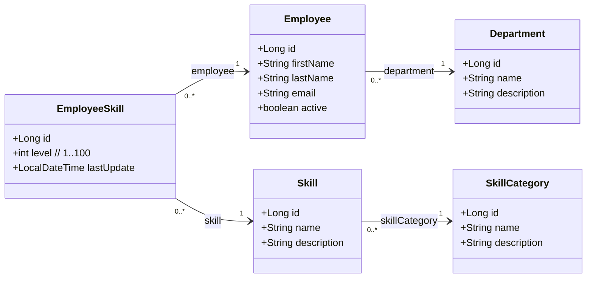
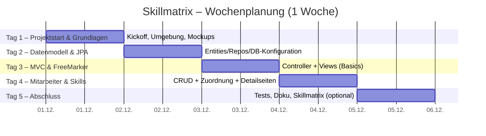

Dieses Dokument beschreibt die Aufgabenstellung, Anforderungen und die tägliche Planung für das 1-wöchige Softwareentwicklungspraktikum.  
Ziel ist es, eine einfache Skillmatrix-Anwendung mit **Spring Boot**, **Spring MVC**, **JPA** und **FreeMarker** zu entwickeln. Als Datenbank nutzt du lokal **H2** (einfacher Start), optional später **MariaDB**.

---

## Projektziel
Die Praktikantin soll innerhalb einer Woche eine vollständige, funktionierende Webanwendung umsetzen, die es ermöglicht:

- Abteilungen anzulegen und zu verwalten
- Mitarbeiter anzulegen und ihnen Abteilungen zuzuordnen
- Skillkategorien und Skills anzulegen
- Mitarbeitern Skills mit Level (1–100) zuzuweisen

Optional:
- Eine Skillmatrix als Radar-Chart anzuzeigen

Die Anwendung soll **Server-Side Rendered** sein (kein Angular), basierend auf:

- Spring Boot
- Spring MVC
- JPA/Hibernate
- FreeMarker Templates
- H2 Datenbank (lokal), optional MariaDB

---

## Anforderungen

### Funktionale Anforderungen (vereinfacht)
1. **Abteilungen**: CRUD und Liste.
2. **Mitarbeitende**: CRUD, gehören zu genau einer Abteilung, Liste.
3. **Skillkategorien**: CRUD und Liste.
4. **Skills**: CRUD, gehören zu genau einer Skillkategorie.
5. **Mitarbeitende ↔ Skills**: Skills mit Level (1–100) zuordnen und ändern; Zuordnung entfernen.

Optional:
- Eine Skillmatrix (Radar‑Chart) pro Mitarbeiter: Werte aus den zugeordneten Skills visualisieren.

## Datenmodell (Mermaid UML)
Das folgende UML-Klassendiagramm zeigt die wichtigsten Entitäten und Relationen der Anwendung.

Hinweise:
- `EmployeeSkill` modelliert die m:n‑Beziehung zwischen Mitarbeitenden und Skills und speichert zusätzlich das Level (1–100) sowie einen Zeitstempel der letzten Änderung.
- Die Kardinalitäten sind so gewählt, dass sie die JPA‑Beziehungen widerspiegeln (z. B. `@ManyToOne` von `Employee` zu `Department`).

## Technische Anforderungen (vereinfacht)

### Technologien
- **Java 17+**
- **Spring Boot**
    - Spring Web (MVC)
    - Spring Data JPA
    - FreeMarker
    - Validation
- **H2** als Entwicklungs‑DB (In‑Memory)
- **Maven**

Optional für später:
- MariaDB + Treiber (Prod/realistische Umgebung)

## Hinweis
Die Anforderungen sind bewusst kompakt gehalten. Du kannst sie im Projektverlauf konkretisieren (z. B. Validierungsregeln, Pflichtfelder). Eine spätere Erweiterung um automatisierte UI/API‑Tests ist möglich, aber nicht Teil dieser Woche.

# Wochenplanung

Der folgende Gantt‑Plan spiegelt die Wochenplanung aus den Abschnitten oben wider.

Hinweise:
- Die Planung orientiert sich an den Tageszielen oben; Meilensteine und Reihenfolgen sind exemplarisch.
- Die Dauerangaben dienen der groben Orientierung. Die tatsächliche Umsetzung kann je nach Vorkenntnissen variieren.

## **Tag 1 – Projektstart & Grundlagen**
### Ziele:
- Projekt verstehen
- Entwicklungsumgebung aufsetzen
- Spring Boot starten
- Anforderungen kennenlernen
- UI Mockup erstellen
- Datenmodell besprechen
- Architektur entwerfen

### Aufgaben:
- Repository klonen, Projekt in IDE öffnen (Java 21, Maven prüfen)
- MariaDB per Docker Compose starten, Verbindung testen
- Spring Boot Grundgerüst starten (Hello World / Health-Check)
- Erste UI-Wireframes/Mockups skizzieren (Navigation, Listen, Formulare)
- Grobes UML-Datenmodell entwerfen und abstimmen
- Architekturentscheidungen festhalten (Pakete, MVC, Templatestruktur)
---

## **Tag 2 – Datenmodell & JPA**
### Ziele:
- Entities anlegen
- Datenbanktabellen generieren
- Repositories erstellen

### Aufgaben:
- JPA-Entities anlegen: Department, Employee, SkillCategory, Skill, EmployeeSkill
- Spring Data Repositories erstellen
- DB-Konfiguration in `application.properties` prüfen/anpassen
- Schema von JPA generieren lassen, Start → Tabellen prüfen
- Demo-/Seed-Daten (z. B. `data.sql`) vorbereiten und laden
- Optional: Testcontainers für Integrationstests einrichten

---

## **Tag 3 – Spring MVC Controller & FreeMarker**
### Ziele:
- Erste CRUD-Funktionen lauffähig machen
- FreeMarker-Templates erstellen

### Aufgaben:
- Controller und Views für Abteilungen (Liste, Anlegen/Bearbeiten)
- Basislayouts/Partials erstellen (`_header.ftl`, `_footer.ftl`, Navigation)
- Validierung und Fehlermeldungen in Formularen anzeigen
- Einfache Styles/Framework (z. B. Tailwind-Build) einbinden
- Smoke-Tests manuell: Navigationsfluss und CRUD durchklicken

---

## **Tag 4 – Mitarbeiter und Skills**
### Ziele:
- Mitarbeiterverwaltung implementieren
- Skills & Kategorien hinzufügen
- Mitarbeiterdetailseite

### Aufgaben:
- Controller/Views für Mitarbeiter (Liste, Formular, Detail)
- CRUD für Skillkategorien und Skills erstellen
- Mitarbeiter-Skills zuordnen und Level pflegen (1–100)
- Mitarbeiterdetailseite mit Skillübersicht (Listen/Badges)
- Navigation/UX abrunden (aktive Menüs, Breadcrumbs)

---

## **Tag 5 – Projektabschluss**
### Ziele:
- Optional: Skillmatrix-Seite fertigstellen
- Aufräumen

### Aufgaben:
- Optionale Skillmatrix-Seite (z. B. Chart.js) anbinden
- Kleine Bugs fixen, Code aufräumen (Formatter/Inspections)
- README und Diagramme aktualisieren
- Einfache Controller-/Service-Tests ergänzen und ausführen
- Kurze Abschlusspräsentation vorbereiten

# Abschluss
Am Ende der Woche soll eine funktionierende Webanwendung entstanden sein, die die Grundstrukturen moderner Java-Webentwicklung widerspiegelt.  
Die Praktikantin hat dabei den kompletten Entwicklungsprozess kennengelernt:

- Planung
- Datenmodellierung
- Backendprogrammierung
- MVC-Architektur
- Template-Rendering
- Datenbankanbindung
- Debugging