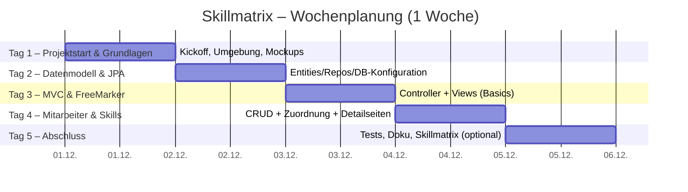
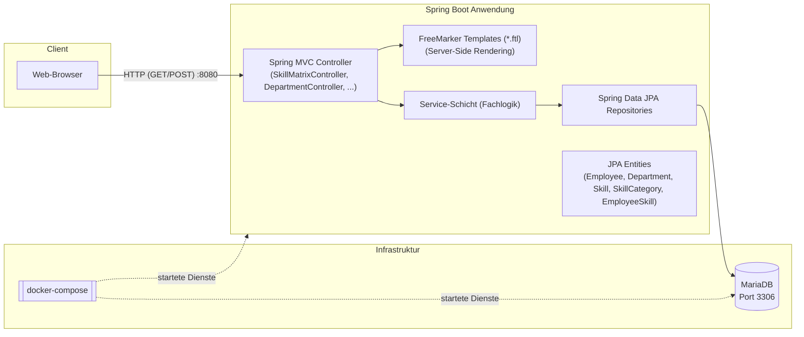

    - FreeMarker
    - Validation
    - MariaDB Driver
- **MariaDB**
- **Maven**


## Anforderungen als BDD (Gherkin)
Die folgenden BDD-Features beschreiben das gewünschte Verhalten aus Nutzersicht. Sie sind technologieagnostisch formuliert und können später für UI- oder API-Tests (z. B. mit Cucumber) verwendet werden.

```gherkin
# language: de
@fachlich @abteilungen
Funktionalität: Abteilungen verwalten
  Um Organisationseinheiten zu pflegen
  möchte ich Abteilungen anlegen, bearbeiten, löschen und anzeigen

  Hintergrund:
    Angenommen es existiert die Abteilung "Entwicklung"

  Szenario: Abteilungsliste anzeigen
    Wenn ich die Abteilungsliste öffne
    Dann sehe ich die Abteilung "Entwicklung" in der Liste

  Szenario: Abteilung anlegen
    Wenn ich eine neue Abteilung mit dem Namen "HR" speichere
    Dann existiert eine Abteilung "HR"

  Szenario: Validierung beim Anlegen (Pflichtfeld Name)
    Wenn ich eine neue Abteilung ohne Namen speichere
    Dann erhalte ich eine Fehlermeldung, dass der Name erforderlich ist
    Und die Abteilung wird nicht angelegt

  Szenario: Abteilung bearbeiten
    Wenn ich die Abteilung "Entwicklung" in "Engineering" umbenenne
    Dann existiert eine Abteilung "Engineering"
    Und die Abteilung "Entwicklung" existiert nicht mehr

  Szenario: Abteilung löschen
    Wenn ich die Abteilung "Engineering" lösche
    Dann existiert die Abteilung "Engineering" nicht mehr
```

```gherkin
# language: de
@fachlich @mitarbeiter
Funktionalität: Mitarbeiter verwalten
  Um Mitarbeitende im Unternehmen zu pflegen
  möchte ich Mitarbeitende CRUD-verwenden und einer Abteilung zuordnen

  Hintergrund:
    Angenommen es existiert die Abteilung "Entwicklung"

  Szenario: Mitarbeiterliste anzeigen
    Wenn ich die Mitarbeiterliste öffne
    Dann sehe ich eine Tabelle mit Vorname, Nachname, E-Mail und Abteilung

  Szenario: Mitarbeiter anlegen
    Wenn ich einen Mitarbeiter mit folgenden Werten speichere
      | firstName | lastName | email             | department  |
      | Alice     | Beispiel | alice@example.org | Entwicklung |
    Dann existiert ein Mitarbeiter "Alice Beispiel" mit E-Mail "alice@example.org" in der Abteilung "Entwicklung"

  Szenario: Validierung beim Anlegen
    Wenn ich einen Mitarbeiter ohne Nachnamen speichere
    Dann erhalte ich eine Fehlermeldung, dass der Nachname erforderlich ist
    Und der Mitarbeiter wird nicht angelegt

  Szenario: E-Mail-Format prüfen (optional)
    Wenn ich einen Mitarbeiter mit E-Mail "falsch" speichere
    Dann erhalte ich eine Fehlermeldung zum ungültigen E-Mail-Format

  Szenario: Mitarbeiter bearbeiten
    Gegeben sei ein Mitarbeiter "Alice Beispiel" in "Entwicklung"
    Wenn ich die Abteilung des Mitarbeiters auf "Entwicklung" belasse und die E-Mail auf "alice.bsp@example.org" ändere
    Dann ist die E-Mail des Mitarbeiters "alice.bsp@example.org"

  Szenario: Mitarbeiterdetailseite
    Gegeben sei ein Mitarbeiter "Alice Beispiel" in "Entwicklung"
    Wenn ich die Detailseite des Mitarbeiters öffne
    Dann sehe ich Stammdaten und eine Übersicht der zugeordneten Skills mit Leveln

  Szenario: Mitarbeiter löschen
    Gegeben sei ein Mitarbeiter "Alice Beispiel"
    Wenn ich den Mitarbeiter lösche
    Dann existiert der Mitarbeiter nicht mehr
```

```gherkin
# language: de
@fachlich @skillkategorien
Funktionalität: Skillkategorien verwalten
  Um Skills logisch zu gruppieren
  möchte ich Skillkategorien anlegen, bearbeiten, löschen und anzeigen

  Szenario: Kategorie anlegen
    Wenn ich eine Skillkategorie "Programmiersprachen" speichere
    Dann existiert die Skillkategorie "Programmiersprachen"

  Szenario: Validierung Name Pflicht
    Wenn ich eine Skillkategorie ohne Namen speichere
    Dann erhalte ich eine Fehlermeldung, dass der Name erforderlich ist

  Szenario: Kategorie bearbeiten und löschen
    Gegeben sei die Skillkategorie "Programmiersprachen"
    Wenn ich den Namen auf "Sprachen" ändere
    Dann existiert die Skillkategorie "Sprachen"
    Wenn ich die Skillkategorie "Sprachen" lösche
    Dann existiert sie nicht mehr
```

```gherkin
# language: de
@fachlich @skills
Funktionalität: Skills verwalten
  Um erfassbare Fähigkeiten zu pflegen
  möchte ich Skills in Kategorien anlegen, bearbeiten, löschen und anzeigen

  Hintergrund:
    Angenommen es existiert die Skillkategorie "Programmiersprachen"

  Szenario: Skill anlegen
    Wenn ich den Skill "Java" in der Kategorie "Programmiersprachen" speichere
    Dann existiert der Skill "Java" in der Kategorie "Programmiersprachen"

  Szenario: Validierung Name Pflicht
    Wenn ich einen Skill ohne Namen speichere
    Dann erhalte ich eine Fehlermeldung, dass der Name erforderlich ist

  Szenario: Skill bearbeiten und löschen
    Gegeben sei der Skill "Java" in der Kategorie "Programmiersprachen"
    Wenn ich den Namen auf "Java SE" ändere
    Dann existiert der Skill "Java SE"
    Wenn ich den Skill "Java SE" lösche
    Dann existiert er nicht mehr
```

```gherkin
# language: de
@fachlich @mitarbeiter_skills
Funktionalität: Mitarbeiter-Skills und Level verwalten
  Um den Kenntnisstand abzubilden
  möchte ich Mitarbeitenden Skills mit einem Level (1–100) zuordnen und pflegen

  Hintergrund:
    Angenommen es existiert der Mitarbeiter "Alice Beispiel" in der Abteilung "Entwicklung"
    Und es existiert der Skill "Java" in der Kategorie "Programmiersprachen"

  Szenario: Skill zuordnen
    Wenn ich dem Mitarbeiter "Alice Beispiel" den Skill "Java" mit Level 65 zuordne
    Dann hat der Mitarbeiter "Alice Beispiel" den Skill "Java" mit Level 65

  Szenario: Level aktualisieren
    Gegeben sei der Mitarbeiter "Alice Beispiel" hat den Skill "Java" mit Level 65
    Wenn ich den Level auf 80 ändere
    Dann ist der Level des Skills "Java" für "Alice Beispiel" 80

  Szenario: Level-Grenzen validieren
    Wenn ich dem Mitarbeiter "Alice Beispiel" den Skill "Java" mit Level 0 zuordne
    Dann erhalte ich eine Fehlermeldung, dass der Level zwischen 1 und 100 liegen muss
    Und die Änderung wird nicht gespeichert

  Szenario: Doppelte Zuordnung verhindern
    Gegeben sei der Mitarbeiter "Alice Beispiel" hat den Skill "Java" mit Level 65
    Wenn ich denselben Skill erneut zuordnen möchte
    Dann erhalte ich eine Fehlermeldung, dass der Skill bereits zugeordnet ist

  Szenario: Skill-Zuordnung entfernen
    Gegeben sei der Mitarbeiter "Alice Beispiel" hat den Skill "Java"
    Wenn ich die Zuordnung entferne
    Dann hat der Mitarbeiter "Alice Beispiel" den Skill "Java" nicht mehr
```

```gherkin
# language: de
@fachlich @skillmatrix
Funktionalität: Skillmatrix anzeigen (optional)
  Um die Fähigkeiten eines Mitarbeiters visuell darzustellen
  möchte ich eine Skillmatrix als Radar-Chart sehen

  Hintergrund:
    Angenommen es existiert der Mitarbeiter "Alice Beispiel"
    Und der Mitarbeiter hat die folgenden Skills
      | skill | level |
      | Java  | 80    |
      | SQL   | 60    |
      | HTML  | 55    |

  Szenario: Skillmatrix für Mitarbeiter anzeigen
    Wenn ich die Skillmatrix für "Alice Beispiel" öffne
    Dann sehe ich ein Radar-Chart mit den Skills und Leveln des Mitarbeiters

  Szenario: Skillmatrix aktualisiert sich bei Leveländerung
    Gegeben sei die Skillmatrix für "Alice Beispiel" ist geöffnet
    Wenn ich den Level des Skills "SQL" von 60 auf 70 ändere
    Dann spiegelt das Radar-Chart den neuen Level 70 für "SQL" wider
```

Hinweis:
- Die hier verwendeten Begriffe orientieren sich an den Abschnitten „Funktionale Anforderungen“ und „Wochenplanung“.
- Die Schritte können für Web-UI-Tests (z. B. Selenium + Cucumber) oder API-Tests (REST) umgesetzt werden.
- Wo nicht explizit in den Anforderungen definiert (z. B. E-Mail-Validierung), sind sinnvolle Standardvalidierungen als optional gekennzeichnet.

---

# Wochenplanung

Der folgende Gantt‑Plan spiegelt die Wochenplanung aus den Abschnitten oben wider.



Hinweise:
- Die Planung orientiert sich an den Tageszielen oben; Meilensteine und Reihenfolgen sind exemplarisch.
- Die Dauerangaben dienen der groben Orientierung. Die tatsächliche Umsetzung kann je nach Vorkenntnissen variieren.


## **Tag 1 – Projektstart & Grundlagen**
### Ziele:
- Projekt verstehen
- Entwicklungsumgebung aufsetzen
- Spring Boot starten
- Anforderungen kennenlernen
- UI Mockup erstellen
- Datenmodell besprechen
- Architektur entwerfen

### Aufgaben:
- Repository klonen, Projekt in IDE öffnen (Java 21, Maven prüfen)
- MariaDB per Docker Compose starten, Verbindung testen
- Spring Boot Grundgerüst starten (Hello World / Health-Check)
- Erste UI-Wireframes/Mockups skizzieren (Navigation, Listen, Formulare)
- Grobes UML-Datenmodell entwerfen und abstimmen
- Architekturentscheidungen festhalten (Pakete, MVC, Templatestruktur)
---

## **Tag 2 – Datenmodell & JPA**
### Ziele:
- Entities anlegen
- Datenbanktabellen generieren
- Repositories erstellen

### Aufgaben:
- JPA-Entities anlegen: Department, Employee, SkillCategory, Skill, EmployeeSkill
- Spring Data Repositories erstellen
- DB-Konfiguration in `application.properties` prüfen/anpassen
- Schema von JPA generieren lassen, Start → Tabellen prüfen
- Demo-/Seed-Daten (z. B. `data.sql`) vorbereiten und laden
- Optional: Testcontainers für Integrationstests einrichten


---

## **Tag 3 – Spring MVC Controller & FreeMarker**
### Ziele:
- Erste CRUD-Funktionen lauffähig machen
- FreeMarker-Templates erstellen

### Aufgaben:
- Controller und Views für Abteilungen (Liste, Anlegen/Bearbeiten)
- Basislayouts/Partials erstellen (`_header.ftl`, `_footer.ftl`, Navigation)
- Validierung und Fehlermeldungen in Formularen anzeigen
- Einfache Styles/Framework (z. B. Tailwind-Build) einbinden
- Smoke-Tests manuell: Navigationsfluss und CRUD durchklicken

---

## **Tag 4 – Mitarbeiter und Skills**
### Ziele:
- Mitarbeiterverwaltung implementieren
- Skills & Kategorien hinzufügen
- Mitarbeiterdetailseite

### Aufgaben:
- Controller/Views für Mitarbeiter (Liste, Formular, Detail)
- CRUD für Skillkategorien und Skills erstellen
- Mitarbeiter-Skills zuordnen und Level pflegen (1–100)
- Mitarbeiterdetailseite mit Skillübersicht (Listen/Badges)
- Navigation/UX abrunden (aktive Menüs, Breadcrumbs)

---

## **Tag 5 – Projektabschluss**
### Ziele:
- Optional: Skillmatrix-Seite fertigstellen
- Aufräumen

### Aufgaben:
- Optionale Skillmatrix-Seite (z. B. Chart.js) anbinden
- Kleine Bugs fixen, Code aufräumen (Formatter/Inspections)
- README und Diagramme aktualisieren
- Einfache Controller-/Service-Tests ergänzen und ausführen
- Kurze Abschlusspräsentation vorbereiten

# Abschluss
Am Ende der Woche soll eine funktionierende Webanwendung entstanden sein, die die Grundstrukturen moderner Java-Webentwicklung widerspiegelt.  
Die Praktikantin hat dabei den kompletten Entwicklungsprozess kennengelernt:

- Planung
- Datenmodellierung
- Backendprogrammierung
- MVC-Architektur
- Template-Rendering
- Datenbankanbindung
- Debugging

## Architekturübersicht (Mermaid)
Das folgende Diagramm zeigt die grobe Architektur der Anwendung mit ihren Hauptkomponenten und deren Interaktionen.



Hinweise:
- Die Views werden serverseitig mit FreeMarker gerendert und als HTML an den Browser ausgeliefert.
- Persistenz erfolgt via Spring Data JPA gegen MariaDB (in `docker-compose.yml`).
- Ports: Anwendung typischerweise auf `8080`, Datenbank auf `3306`.
